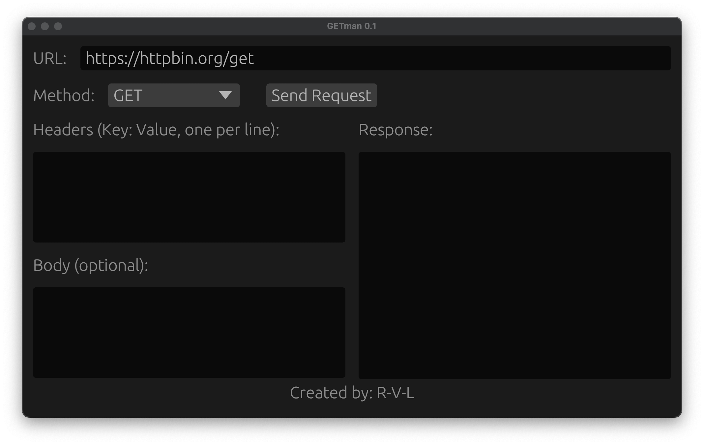

# GETman

A Postman-like application to make HTTP requests, built to be extremely simple and easy to use. This project is developed in Rust and utilizes several key dependencies to provide an intuitive and efficient interface.

## Features

- Make HTTP requests (GET, POST, PUT, DELETE, etc.)
- Simple and user-friendly interface
- JSON response formatting
- Lightweight and fast

## Screenshots




## Dependencies

This project uses the following Rust crates:

- [egui](https://crates.io/crates/egui): A simple, immediate mode GUI in Rust for building the user interface.
- [reqwest](https://crates.io/crates/reqwest): A powerful HTTP client for making requests.
- [eframe](https://crates.io/crates/eframe): A framework for building native desktop applications using `egui`.
- [serde_json](https://crates.io/crates/serde_json): A crate for serializing and deserializing JSON data.

## Installation

To build this project, you need to have Rust installed. If you don't have Rust yet, you can install it from [here](https://www.rust-lang.org/tools/install).

Clone the repository:

```bash
git clone https://github.com/R-V-L/GETman/
cd GETman
```

Install dependencies and build:
```bash
cargo build --release
cargo run
```

## License

This project is licensed under the MIT License.
